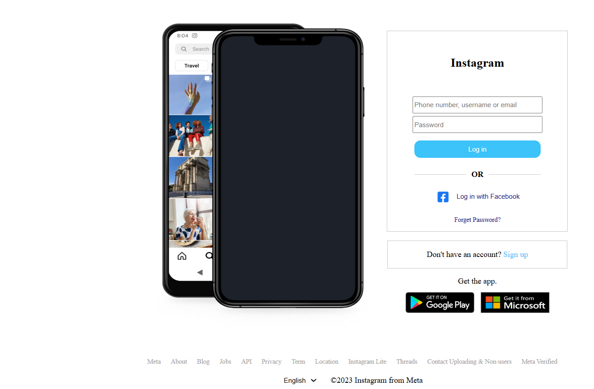

# Instagram Clone

A front-end clone of Instagram’s login page built with HTML and CSS, replicating its design and layout. This project showcases skills in responsive design and UI development.

## Features
- **Authentic UI**: Mimics Instagram’s login page with a phone mockup, form, and app store links.
- **Responsive Design**: Adapts to various screen sizes using flexbox.
- **Interactive Elements**: Includes a login form, Facebook login button, and language selector.

## Screenshots


## Tech Stack
- **HTML5**: Page structure.
- **CSS3**: Styling with flexbox and custom fonts.
- **Assets**: Images for logos and mockups.

## Setup
1. Clone the repository:
   ```bash
   git clone https://github.com/portfolio-profile/instagram-clone.git
